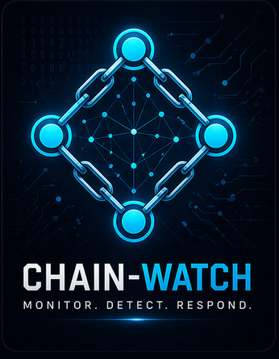

[](LICENSE) [](https://github.com/elin-olsson/chain-watch/actions/workflows/ci.yml)

A Python CLI security log correlator for Linux systems.

Reads multiple log sources simultaneously — `auth.log`, UFW/firewalld logs, `auditd`, and the systemd journal — and correlates events by source IP and time window to detect multi-stage attack chains: port scans followed by brute-force, brute-force followed by successful login, and post-login lateral movement.

## Prerequisites

- Python 3.10 or later
- No external packages required at runtime — stdlib only

Check your Python version:
```bash
python3 --version
```

## Installation

Clone the repository and navigate to the tool directory:
```bash
git clone https://github.com/elin-olsson/chain-watch.git
cd chain-watch
```

No dependencies to install. Run directly:
```bash
sudo python3 chainwatch.py
```

Install `pytest` to run the test suite:
```bash
pip install pytest
```

## Usage

```bash
sudo python3 chainwatch.py [LOG_DIR] [options]
```

```bash
# Scan default log paths (auto-detected)
sudo python3 chainwatch.py

# Scan logs from a specific directory
sudo python3 chainwatch.py /var/log

# Use a custom correlation window (default: 600 s)
sudo python3 chainwatch.py --window 300

# Filter by time range
sudo python3 chainwatch.py --since 03:00 --until 05:00
sudo python3 chainwatch.py --since "2026-04-21 00:00"

# Watch logs live and alert on new incidents (Ctrl+C to stop)
sudo python3 chainwatch.py --follow
sudo python3 chainwatch.py --follow --interval 10

# Read from the systemd journal (useful on Fedora/RHEL/Arch)
sudo python3 chainwatch.py --journal
sudo python3 chainwatch.py --journal --since 06:00
sudo python3 chainwatch.py --journal --follow

# Write results to an HTML report
sudo python3 chainwatch.py --html report.html

# Write results to JSON
sudo python3 chainwatch.py --json report.json

# Specify log files explicitly
sudo python3 chainwatch.py \
    --auth-log  /var/log/auth.log \
    --ufw-log   /var/log/ufw.log \
    --audit-log /var/log/audit/audit.log

# Fedora / Red Hat paths
sudo python3 chainwatch.py \
    --auth-log  /var/log/secure \
    --ufw-log   /var/log/messages \
    --audit-log /var/log/audit/audit.log
```

### Flags

| Flag | Description |
|---|---|
| `--window SECONDS` | Correlation time window in seconds (default: 600) |
| `--since TIME` | Ignore events before TIME (`HH:MM`, `HH:MM:SS`, or `YYYY-MM-DD HH:MM[:SS]`) |
| `--until TIME` | Ignore events after TIME (same formats as `--since`) |
| `--journal` | Read from the systemd journal via `journalctl` (merged with file sources) |
| `--follow` | Watch log files and alert on new incidents in real time |
| `--interval SECONDS` | Poll interval for `--follow` mode in seconds (default: 5) |
| `--json FILE` | Write JSON report to FILE |
| `--html FILE` | Write self-contained HTML report to FILE |
| `--auth-log FILE` | Explicit path to auth.log / secure |
| `--ufw-log FILE` | Explicit path to firewall log |
| `--audit-log FILE` | Explicit path to audit/audit.log |

## Log sources

| Source | Default paths | Events extracted |
|---|---|---|
| auth.log / secure | `/var/log/auth.log`, `/var/log/secure` | SSH brute-force, successful logins, sudo usage |
| Firewall log | `/var/log/ufw.log`, `/var/log/kern.log`, `/var/log/messages` | Blocked/allowed packets with source IP and port |
| auditd | `/var/log/audit/audit.log` | execve syscalls, user additions/deletions, PAM auth events |
| systemd journal | `journalctl` (via `--journal`) | SSH logins, sudo usage, kernel firewall events |

chain-watch automatically searches the default paths when no explicit path is given. All parsers handle missing or unreadable files gracefully — if a log source is not present, that source is silently skipped.

The `--journal` flag reads from the systemd journal using `journalctl` and merges the results with any file-based sources. It is particularly useful on systemd-based distributions (Fedora, Arch, recent Ubuntu) where logs are primarily stored in the journal rather than plain text files. Combine with `--since` to limit the query to a specific time range and avoid reading the full journal history.

## Detected attack chains

chain-watch detects six attack patterns. Events are grouped by source IP within a rolling time window and escalated when patterns match.

**brute_force** `[medium]`  
Five or more failed logins from the same source IP within the time window. Typical of automated password spraying or SSH dictionary attacks. Detected from `auth.log` / `secure`.

**brute_then_login** `[critical]`  
A brute-force cluster followed by a successful login from the same IP within the window. Indicates a password was guessed or found. All contributing failed attempts and the successful login are included as correlated events.

**portscan_then_login** `[high]`  
Firewall block events across at least two distinct destination ports from an IP, followed by a login attempt from the same IP within the window. The two-port minimum filters single blocked connections that are normal background noise. Each block and auth event is paired individually — only events within the window of each other are included, so a stale block from hours earlier is not falsely attributed to a later login attempt.

**lateral_movement** `[high / critical]`  
A successful login followed by a suspicious execve (via auditd) or a `sudo` invocation (via auth.log) by the same user within the window. Correlated by user identity, not IP — events are linked back to the IP of the preceding SSH session. Severity is `critical` for network tools (`wget`, `curl`, `nc`, `ncat`, `netcat`) or `sudo` to root, and `high` for shell spawning (`bash`, `sh`) or `sudo` to any other user.

**credential_stuffing** `[high]`  
Five or more distinct usernames attempted from the same source IP within the time window. Unlike brute_force (which focuses on attempt volume), credential stuffing targets breadth — trying many different accounts with one or few attempts each, typical of attacks using leaked credential databases. Both chains can fire independently for the same IP.

**account_manipulation** `[critical]`  
A successful login followed by a user account creation (`ADD_USER`) or deletion (`DEL_USER`) by the same user within the window, detected via auditd. A strong indicator of post-compromise activity — creating a backdoor account or removing legitimate users to lock out administrators.

| Chain | Severity | Trigger |
|---|---|---|
| `brute_force` | medium | ≥ 5 failed logins from the same IP in the window |
| `brute_then_login` | critical | brute_force cluster + successful login from same IP in window |
| `portscan_then_login` | high | firewall blocks + login attempt from same IP in window |
| `lateral_movement` | high / critical | successful login + suspicious execve by same user in window |
| `credential_stuffing` | high | ≥ 5 distinct usernames tried from the same IP in the window |
| `account_manipulation` | critical | successful login + ADD_USER or DEL_USER by same user in window |

## Supported firewalls

chain-watch detects packet log lines from any of the following in the same firewall log:

| Firewall | Detected format |
|---|---|
| UFW | `[UFW BLOCK]` / `[UFW ALLOW]` |
| firewalld | `FINAL_REJECT:` / `IN_<zone>_DROP:` / `IN_<zone>_REJECT:` / `IN_<zone>_ACCEPT:` |
| iptables | `DROPPED:` / `REJECTED:` |
| nftables | `nft ...:` prefix |

Lines from multiple firewall types in the same log file are handled correctly — common when `kern.log` or `/var/log/messages` accumulates output from several sources.

## Example output

Running against a live system with several incidents:

```
══════════════════════════════════════════════════════════════
  chain-watch  —  Attack Chain Correlation Report
══════════════════════════════════════════════════════════════
  Generated   2026-04-21 03:47:12
  Window      600 s
  Parsed      847 events  (512 auth  ·  298 ufw  ·  37 audit)
  Incidents   3

  Top attacking IPs
    185.220.101.47        23 attempts  ████████████████████
    45.95.147.208          7 attempts  ██████
    80.82.70.202           7 attempts  ██████

  Most targeted ports
    22/TCP               18 blocks    ████████████████████
    3306/TCP              4 blocks    ████
    8080/TCP              2 blocks    ██

  Events per hour
    03:00  ████████████████████  47
    04:00  █████                 12

──────────────────────────────────────────────────────────────
  [CRITICAL]  #1  brute_then_login  —  185.220.101.47
  2026-04-21  03:12:04  →  03:22:47  (10m 43s)  ·  11 events
──────────────────────────────────────────────────────────────

    03:12:04  failed_login          user=root          ip=185.220.101.47
    03:13:51  failed_login          user=root          ip=185.220.101.47
    03:15:22  failed_login          user=root          ip=185.220.101.47
    03:17:09  failed_login          user=root          ip=185.220.101.47
    03:19:33  failed_login          user=root          ip=185.220.101.47
    03:20:05  failed_login          user=admin         ip=185.220.101.47
    03:20:14  failed_login          user=admin         ip=185.220.101.47
    03:20:29  failed_login          user=admin         ip=185.220.101.47
    03:21:01  failed_login          user=admin         ip=185.220.101.47
    03:21:44  failed_login          user=admin         ip=185.220.101.47
    03:22:47  successful_login      user=admin         ip=185.220.101.47

──────────────────────────────────────────────────────────────
  [HIGH    ]  #2  portscan_then_login  —  45.95.147.208
  2026-04-21  03:31:02  →  03:38:15  (7m 13s)  ·  4 events
──────────────────────────────────────────────────────────────

    03:31:02  fw_block              src=45.95.147.208   port=22/TCP
    03:33:17  fw_block              src=45.95.147.208   port=80/TCP
    03:35:44  fw_block              src=45.95.147.208   port=443/TCP
    03:38:15  failed_login          user=root           ip=45.95.147.208

──────────────────────────────────────────────────────────────
  [MEDIUM  ]  #3  brute_force  —  80.82.70.202
  2026-04-21  04:01:09  →  04:06:52  (5m 43s)  ·  7 events
──────────────────────────────────────────────────────────────

    04:01:09  failed_login          user=pi             ip=80.82.70.202
    04:02:18  failed_login          user=pi             ip=80.82.70.202
    04:03:32  failed_login          user=ubuntu         ip=80.82.70.202
    04:04:01  failed_login          user=ubuntu         ip=80.82.70.202
    04:04:55  failed_login          user=admin          ip=80.82.70.202
    04:05:47  failed_login          user=admin          ip=80.82.70.202
    04:06:52  failed_login          user=root           ip=80.82.70.202

══════════════════════════════════════════════════════════════
```

### HTML report

Use `--html <file>` to generate a self-contained HTML report with colour-coded severity bands and collapsible event lists:

```bash
sudo python3 chainwatch.py --html report.html
```

Open `report.html` in any browser — no internet connection required.

### JSON export

Use `--json <file>` for machine-readable output suitable for scripting or integration with SIEMs:

```bash
sudo python3 chainwatch.py --json report.json
```

Output includes a timestamp, parsed event counts, and an array of incident objects with `chain_type`, `source_ip`, `severity`, `start_time`, `end_time`, `duration_seconds`, and `events` fields.

## How it works

Events from each log source are parsed and normalised into typed event dicts with a consistent `timestamp` and `source_ip`. Events are then grouped by source IP across all four sources. For each IP, chain-watch applies a sliding time window: when events from multiple sources cluster within the window, the relevant chain conditions are evaluated in order of severity — a `brute_then_login` supersedes a plain `brute_force` for the same cluster.

`lateral_movement` and `account_manipulation` are exceptions: auditd records carry a user identity but no IP. chain-watch links them back to the IP of the most recent successful login for that user within the window, making cross-source correlation possible without needing kernel-level network tracking.

## Dependencies

No runtime dependencies — stdlib only. Install `pytest` to run the test suite:

```bash
pip install pytest
python -m pytest tests/
```

| Package | Version | Purpose |
|---|---|---|
| `pytest` | ≥ 9.0.3 | Test suite only — not required at runtime |

---

<p align="center">
  
</p>

<p align="center">
  <sub>The banner and logo are &copy; 2026 shadowfox.se — all rights reserved, not covered by the MIT license.</sub>
</p>
